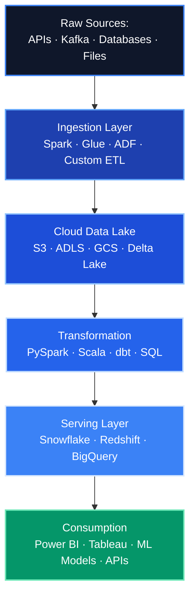
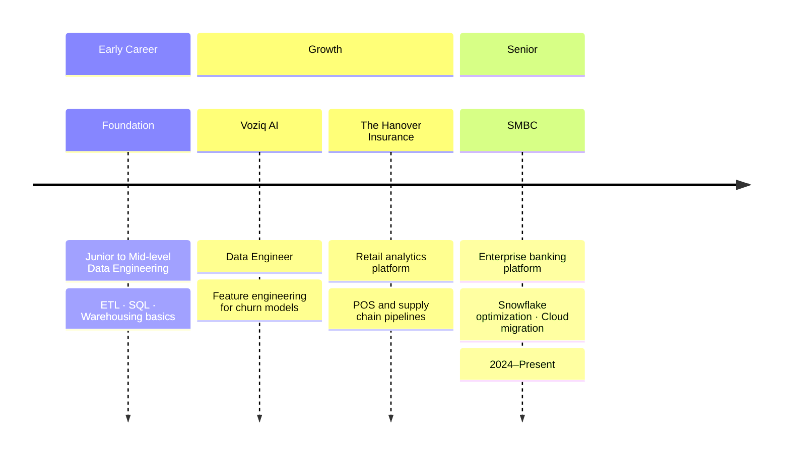

# 👋 Hello, I'm Punith_A
### Data Engineer | Aspiring IT Project Manager | AI Enthusiast

---

## 🎯 ABOUT ME

**Data Engineer** with **4+ years of experience** designing and delivering enterprise-scale data platforms across **financial services, insurance, retail, and telecom** sectors. I specialize in building robust, cloud-native data architectures using modern lakehouse patterns translating raw data into reliable, high-performance analytical systems.

I've driven significant cost and performance wins including **Snowflake compute cost reductions**, **query latency improvements**, and large-scale **cloud migration projects**. My engineering philosophy: build for reliability, optimize for cost, and scale for the future.

### 📊 IMPACT AT A GLANCE

| **Area** | **Achievement** | **Impact** |
|:---------|:---------------:|:-----------|
| **Cloud Migrations** | AWS / GCP / Azure | Enterprise-scale platform modernization |
| **Cost Optimization** | Snowflake & Spark tuning | Significant compute cost savings delivered |
| **Streaming Pipelines** | Real-time data platforms | Sub-minute latency on production systems |
| **Data Domains** | FinServ · Insurance · Retail · Telecom | Cross-industry platform expertise |
| **ML Engineering** | Feature pipelines & model-ready datasets | Accelerated model deployment cycles |
| **Certifications** | Databricks · Azure · AWS | Triple-cloud certified practitioner |

---

## 💼 PROFESSIONAL EXPERIENCE

### 🏦 SMBC — *Data Engineer*
Enterprise banking data platform work across reporting, analytics, and pipeline engineering.

### 🛒 The Hanover Insurance — *Data Engineer*
Retail data platform engineering; supply chain and POS analytics pipelines.

### 🤖 Voziq AI — *Data Engineer*
AI/ML data infrastructure; churn prediction feature pipelines and model data workflows.

---

## 🏗️ ARCHITECTURE APPROACH

---

## 🛠️ TECHNOLOGY STACK

### **Core Languages**

### **Big Data & Processing**

### **Cloud Platforms**

### **Data Warehousing**

### **Orchestration & DevOps**

### **Analytics & ML**

---

## 📈 CAREER TIMELINE

---

## 🚀 FEATURED PROJECTS

### 📊 Chronic Kidney Disease Prediction — ML + Interpretability
End-to-end ML pipeline built on the UCI CKD dataset. Focused on clinical interpretability using **SHAP values, odds ratios, and decision tree visualizations** — designed for healthcare stakeholder communication, not just model accuracy.

**Stack:** Python · Scikit-learn · SHAP · Pandas · Matplotlib

---

### 🖥️ GitOptima — GitHub Profile Optimizer
Terminal-aesthetic developer tool for GitHub profile analysis and optimization. Built with a polished UI targeting engineers who want to sharpen their personal brand and portfolio positioning.

**Stack:** Python · GitHub API · Rich CLI

---

### 🏭 Cloud Data Platform Migrations
Multiple enterprise cloud migration projects across AWS, GCP, and Azure — moving legacy on-premise data systems to modern lakehouse architectures with measurable latency and cost improvements.

**Stack:** Spark · Databricks · Snowflake · Airflow · Delta Lake · dbt

---

## 🎓 EDUCATION & CERTIFICATIONS

| **Credential** | **Issuer** | **Focus** |
|:---------------|:----------:|:----------|
| 🎓 Master's — IT Project Management | Clark University | Technology leadership & delivery |
| ☁️ Databricks Certified | Databricks | Lakehouse & Spark engineering |
| ☁️ Microsoft Azure Certified | Microsoft | Cloud data engineering on Azure |
| ☁️ AWS Certified | Amazon Web Services | Cloud architecture & services |

---

## 📊 GITHUB STATS

---

## 💡 ENGINEERING PHILOSOPHY

> *"Great data engineering is invisible — pipelines run silently, warehouses respond instantly, and business teams make confident decisions without wondering where the numbers come from. That's the standard I build to."*

**Core principles I ship by:**

⚡ **Performance-first** — Profile before optimizing; instrument everything  
🔁 **Idempotency by default** — Every pipeline should be safely re-runnable  
💸 **Cost as a metric** — Cloud spend is an engineering responsibility, not just finance's  
📐 **Schema as contract** — Data contracts prevent downstream chaos  
🧪 **Test your data** — Data quality checks are not optional in production

---

**Open to Senior Data Engineer · Data Architect · Platform Engineer roles (Remote / India)**  
📬 Let's connect on [LinkedIn](https://www.linkedin.com/in/punith-anumala)

